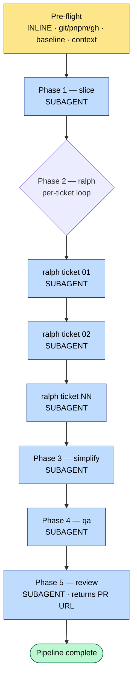

# clanker — Design rationale

Background reading for humans editing the orchestrator. The runtime does **not** read this file each pipeline — `SKILL.md` is the only file the orchestrator loads.

## Workflow diagram

**Legend.** Yellow = runs **inline** in the orchestrator (needs to talk to the user or run privileged shell setup). Blue = dispatched as a **subagent** (context isolation; orchestrator only sees the structured return block).

## Why subagents (and why per-ticket for ralph)

- **Context isolation.** Each phase produces a large transcript (file reads, test output, browser screenshots). Keeping that out of the orchestrator's context means later phases stay sharp and gates stay cheap to evaluate.
- **Per-ticket ralph is the big win.** A single ticket's TDD loop can run dozens of iterations of red → green → refactor → commit. If ticket 01's transcript bleeds into ticket 02, ticket 02 starts already half-poisoned. One subagent per ticket gives each slice a clean room.
- **File-based handoff is the contract.** Subagents never need to return code — they write artifacts to disk. The orchestrator reads disk + the structured return block to gate.

## Why a slim dispatch prompt

The orchestrator's dispatch prompt is **small — well under 20 lines**. Never paste the body of `SKILL.md` into the prompt. Subagents have `Read` access to the repo and load their own instructions from disk.

Two reasons this matters:

1. **Orchestrator context stays tiny.** It only holds paths and structured return blocks — never SKILL.md bodies or phase transcripts.
2. **Subagent context loads only what it needs.** Its own SKILL.md + its single input artifact + the shared `.clanker/context.md`. Nothing about prior phases.

If a subagent comes back asking *"what do I do?"* — the SKILL.md path was wrong. Verify the file exists before dispatching.

## Why `.clanker/` scratch space

The pre-flight builds three artifacts that every later phase can read but nothing outside the pipeline cares about:

| File | Purpose | Lifecycle |
|---|---|---|
| `.clanker/context.md` | CLAUDE.md + project docs concatenated for subagents | Regenerated when source docs are newer |
| `.clanker/baseline.md` | Recorded pre-pipeline test pass + commit SHA | Overwritten each run |
| `.clanker/simplify-notes.md` | Ralph's out-of-scope spots, ticket-scoped headings | Appended during ralph; consumed by simplify |

These are pipeline scratch — `.gitignore`d. They are not source of truth, just the orchestrator's shared blackboard.

## Why no auto-recovery

If any phase reports a hard block, the orchestrator surfaces it and stops. Reasons:

- **Auto-recovery hides regressions.** A pipeline that silently retries QA after deleting failing tests is the failure mode the article warns about.
- **The human's job is at the edges.** Pre-flight inputs and final review. A blocked phase belongs in the human's queue, not in a retry loop.
- **Reverting commits is destructive.** Ralph commits are the work product. Never roll them back to "fix" a downstream phase.

## Why sequential, never parallel

- **Ticket NN+1 may depend on commits from ticket NN.** Slicing is supposed to prevent this, but reality leaks. Sequential is the safe default.
- **Parallel ralph would defeat per-ticket context isolation.** Two slice transcripts on the same branch is the same problem as one bloated transcript.

If parallelism is wanted, do it at the **pipeline** level (multiple branches in `git worktree`s, each running its own `/clanker`), not at the ticket level.
